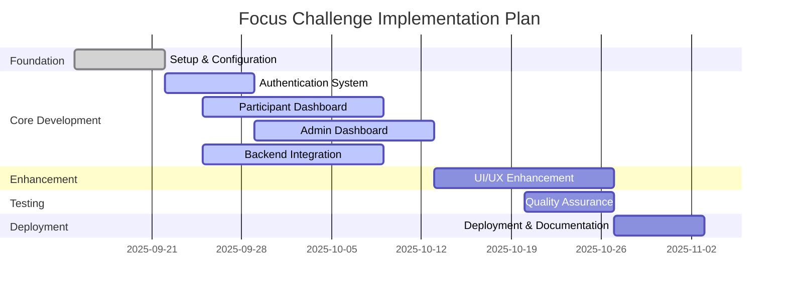

# Implementation Plan
## Focus Challenge Application

**Version**: 1.0  
**Date**: September 11, 2025  
**Author**: AI Assistant  

---

## Table of Contents
1. [Introduction](#1-introduction)
2. [Project Overview](#2-project-overview)
3. [Technology Stack](#3-technology-stack)
4. [Implementation Phases](#4-implementation-phases)
   - [Phase 1: Foundation and Setup](#phase-1-foundation-and-setup)
   - [Phase 2: Core Functionality Development](#phase-2-core-functionality-development)
   - [Phase 3: Advanced Features and UI Enhancement](#phase-3-advanced-features-and-ui-enhancement)
   - [Phase 4: Testing and Quality Assurance](#phase-4-testing-and-quality-assurance)
   - [Phase 5: Deployment and Documentation](#phase-5-deployment-and-documentation)
5. [Detailed Task Breakdown](#5-detailed-task-breakdown)
6. [Resource Allocation](#6-resource-allocation)
7. [Timeline](#7-timeline)
8. [Risk Management](#8-risk-management)
9. [Success Metrics](#9-success-metrics)

---

## 1. Introduction

This document outlines the implementation plan for the Focus Challenge Application. It provides a structured approach to developing the application based on the requirements defined in the Product Requirements Document (PRD).

## 2. Project Overview

The Focus Challenge Application is a web-based platform designed to help Muslims engage in a structured personal development challenge. The application includes participant and administrator dashboards, task management, progress tracking, and gamification elements.

Key features include:
- User authentication and role-based access control
- Daily challenge tasks with categorization and difficulty levels
- Progress tracking and visualization
- Leaderboard functionality
- Administrative challenge management

## 3. Technology Stack

Based on the project analysis, the technology stack includes:

| Layer | Technology |
|-------|------------|
| Frontend Framework | React 18 with TypeScript |
| Build Tool | Vite |
| Styling | TailwindCSS |
| Backend | Firebase (Authentication and Firestore) |
| State Management | React Hooks and Context API |
| Icons | Lucide React |
| Deployment | Firebase Hosting with GitHub Actions |

## 4. Implementation Phases

### Phase 1: Foundation and Setup
**Duration**: 1 week
**Objective**: Establish the development environment and project structure

Key activities:
- Set up development environment with Node.js, npm, and required dependencies
- Initialize React project with Vite
- Configure TypeScript and TailwindCSS
- Set up Firebase project and integrate authentication
- Create basic project folder structure
- Implement basic routing

### Phase 2: Core Functionality Development
**Duration**: 3 weeks
**Objective**: Implement core application features

Key activities:
- Develop user authentication system (login, registration, password reset)
- Create participant dashboard with basic UI components
- Implement task management system
- Develop progress tracking functionality
- Create admin dashboard with basic UI
- Implement challenge management features (start/stop challenge)

### Phase 3: Advanced Features and UI Enhancement
**Duration**: 2 weeks
**Objective**: Enhance user experience and implement advanced features

Key activities:
- Implement leaderboard functionality
- Develop comprehensive admin task management
- Create detailed progress visualization
- Enhance UI/UX with responsive design
- Implement notifications and reminders
- Add search and filtering capabilities

### Phase 4: Testing and Quality Assurance
**Duration**: 1 week
**Objective**: Ensure application quality and performance

Key activities:
- Conduct unit testing for core functions
- Perform integration testing
- Execute user acceptance testing
- Optimize performance and fix bugs
- Ensure cross-browser compatibility
- Security testing

### Phase 5: Deployment and Documentation
**Duration**: 1 week
**Objective**: Deploy the application and create comprehensive documentation

Key activities:
- Set up continuous deployment with GitHub Actions
- Deploy to Firebase Hosting
- Create user documentation
- Develop administrator guide
- Prepare project documentation
- Conduct final testing on production environment

## 5. Detailed Task Breakdown

### Authentication System
| Task | Description | Estimated Time | Dependencies |
|------|-------------|----------------|--------------|
| AUTH-1 | Set up Firebase Authentication | 2 days | Firebase project |
| AUTH-2 | Create login page UI | 1 day | TailwindCSS |
| AUTH-3 | Create registration page UI | 1 day | TailwindCSS |
| AUTH-4 | Implement authentication logic | 2 days | AUTH-1 |
| AUTH-5 | Implement role-based access control | 2 days | AUTH-4 |

### Participant Dashboard
| Task | Description | Estimated Time | Dependencies |
|------|-------------|----------------|--------------|
| PD-1 | Create dashboard layout | 2 days | React, TailwindCSS |
| PD-2 | Implement user profile display | 1 day | AUTH-4 |
| PD-3 | Create task display component | 2 days | Firebase integration |
| PD-4 | Implement task completion functionality | 2 days | PD-3 |
| PD-5 | Create progress tracking visualization | 3 days | PD-4 |
| PD-6 | Implement leaderboard display | 2 days | Backend data |

### Admin Dashboard
| Task | Description | Estimated Time | Dependencies |
|------|-------------|----------------|--------------|
| AD-1 | Create admin dashboard layout | 2 days | React, TailwindCSS |
| AD-2 | Implement challenge control panel | 2 days | Firebase integration |
| AD-3 | Create task management interface | 3 days | Task data model |
| AD-4 | Implement participant progress monitoring | 3 days | Progress tracking |
| AD-5 | Add statistics and reporting | 2 days | Data aggregation |

### Backend Integration
| Task | Description | Estimated Time | Dependencies |
|------|-------------|----------------|--------------|
| BE-1 | Set up Firestore database structure | 2 days | Firebase project |
| BE-2 | Implement data models | 2 days | BE-1 |
| BE-3 | Create CRUD operations for tasks | 2 days | BE-2 |
| BE-4 | Implement progress tracking backend | 2 days | BE-2 |
| BE-5 | Create leaderboard data management | 2 days | BE-2 |

### UI/UX Enhancement
| Task | Description | Estimated Time | Dependencies |
|------|-------------|----------------|--------------|
| UI-1 | Implement responsive design | 3 days | All components |
| UI-2 | Add animations and transitions | 2 days | UI-1 |
| UI-3 | Implement dark mode support | 1 day | TailwindCSS |
| UI-4 | Create mobile-friendly interfaces | 2 days | UI-1 |

### Testing
| Task | Description | Estimated Time | Dependencies |
|------|-------------|----------------|--------------|
| TEST-1 | Write unit tests for authentication | 2 days | AUTH functionality |
| TEST-2 | Write unit tests for task management | 2 days | Task functionality |
| TEST-3 | Write unit tests for progress tracking | 2 days | Progress functionality |
| TEST-4 | Conduct integration testing | 2 days | All components |
| TEST-5 | Perform user acceptance testing | 1 day | Complete application |

### Deployment
| Task | Description | Estimated Time | Dependencies |
|------|-------------|----------------|--------------|
| DEPLOY-1 | Set up Firebase Hosting | 1 day | Firebase project |
| DEPLOY-2 | Configure GitHub Actions for CI/CD | 2 days | GitHub repository |
| DEPLOY-3 | Implement environment configuration | 1 day | DEPLOY-1 |
| DEPLOY-4 | Conduct production testing | 1 day | Complete deployment |
| DEPLOY-5 | Create deployment documentation | 1 day | DEPLOY-2 |

## 6. Resource Allocation

### Development Team
| Role | Responsibilities | Time Commitment |
|------|------------------|-----------------|
| Full Stack Developer | Frontend and backend development | 80% |
| UI/UX Designer | Interface design and user experience | 40% |
| QA Engineer | Testing and quality assurance | 50% |
| DevOps Engineer | Deployment and infrastructure | 30% |
| Technical Writer | Documentation | 20% |

### Tools and Services
| Tool | Purpose | Provider |
|------|---------|----------|
| GitHub | Version control and CI/CD | GitHub |
| Firebase | Backend services | Google |
| Figma | UI/UX Design | Figma |
| Jest | Testing framework | Facebook |
| Vite | Build tool | Vite |

## 7. Timeline

## 8. Risk Management

### Technical Risks
| Risk | Probability | Impact | Mitigation Strategy |
|------|-------------|--------|-------------------|
| Firebase integration issues | Medium | High | Create proof of concept early, maintain fallback options |
| Performance issues with real-time updates | Medium | Medium | Implement efficient data fetching and caching |
| Cross-browser compatibility problems | Low | Medium | Test on multiple browsers throughout development |

### Project Risks
| Risk | Probability | Impact | Mitigation Strategy |
|------|-------------|--------|-------------------|
| Feature creep | High | Medium | Strictly follow PRD, implement change control process |
| Resource unavailability | Low | High | Cross-train team members, maintain resource pool |
| Timeline delays | Medium | High | Build buffer time, conduct regular progress reviews |

### Security Risks
| Risk | Probability | Impact | Mitigation Strategy |
|------|-------------|--------|-------------------|
| Data breach | Low | High | Implement Firebase security rules, encrypt sensitive data |
| Unauthorized access | Medium | Medium | Implement strict authentication and authorization |

## 9. Success Metrics

### Functional Metrics
| Metric | Target | Measurement Method |
|--------|--------|-------------------|
| User registration completion rate | >90% | Analytics tracking |
| Task completion rate | >70% | Database tracking |
| User retention (7-day) | >60% | Analytics tracking |
| Admin task management efficiency | <2 minutes per task | Time tracking |

### Performance Metrics
| Metric | Target | Measurement Method |
|--------|--------|-------------------|
| Page load time | <3 seconds | Performance testing |
| Real-time update latency | <2 seconds | Performance testing |
| Uptime | 99% | Monitoring tools |

### User Satisfaction Metrics
| Metric | Target | Measurement Method |
|--------|--------|-------------------|
| User satisfaction score | >4.0/5.0 | User surveys |
| Support ticket volume | <5 per week | Support system tracking |
| Feature adoption rate | >80% | Analytics tracking |

---

**Document Approval**

| Name | Role | Signature | Date |
|------|------|-----------|------|
| Jabir Abdurahiman | Product Manager | | |
| Development Team | Engineering | | |

**Change History**

| Version | Date | Author | Description |
|---------|------|--------|-------------|
| 1.0 | September 11, 2025 | AI Assistant | Initial version |